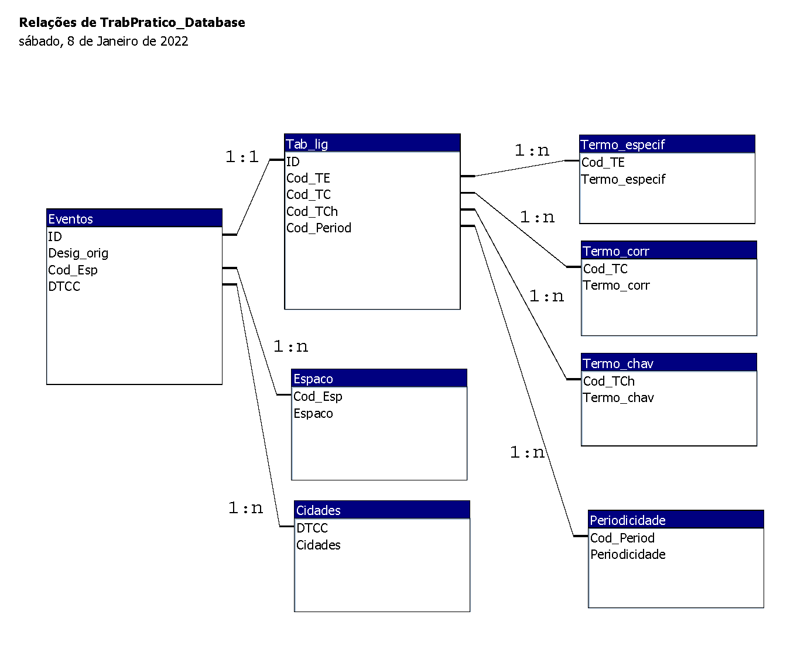

<B>CEBDSIG 
Trabalho prático – Relatório e apresentação</B> 
# Normalização de base dados relacional
Unidade curricular - <B>Criação e Estruturação de Bases de Dados em SIG</B> 2021/22 
Mestrado em Sistemas de Informação Geográfica e Modelação Territorial Aplicados ao Ordenamento 
IGOT - Instituto de Geografia e Ordenamento do Território 
UL - Universidade de Lisboa 

https://github.com/Norge0/CEBDSIG

